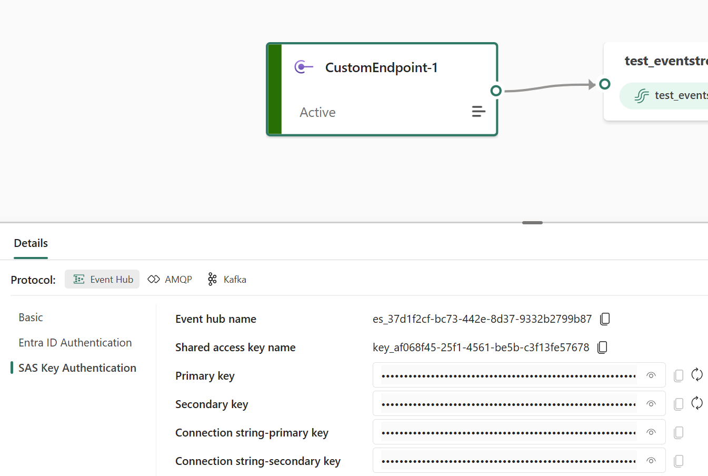
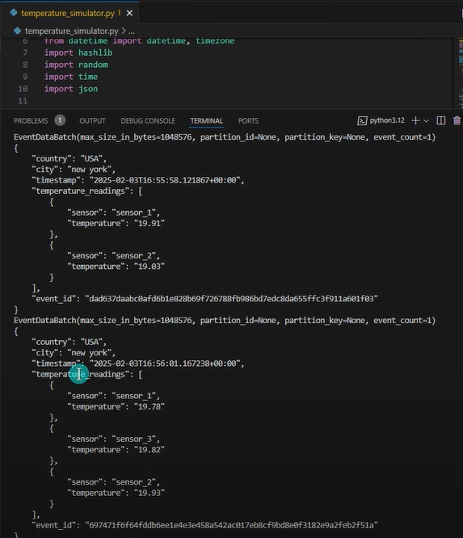
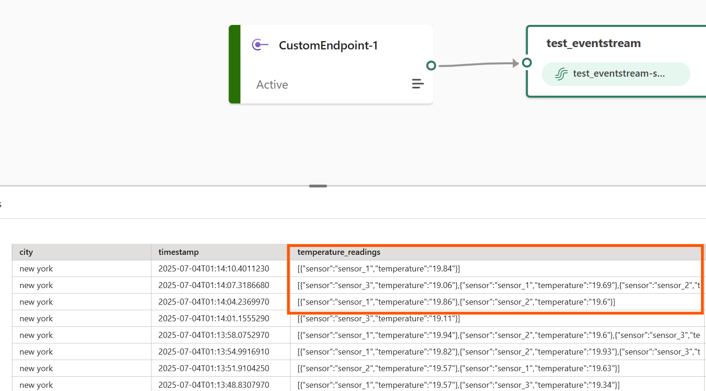
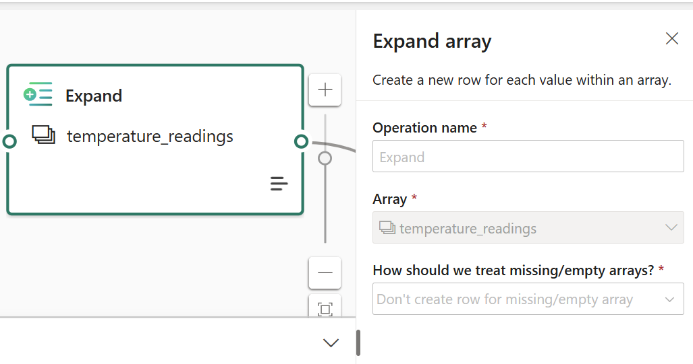

# Eventstream
Event Stream using Fabric

ETL Process for a real-time data using Eventstream
1. Configure Python script to stream data using Event Hub protocol
 

2. Run the script to start streaming

3. Some rows have more than one reading coming from different censors

4. Add Expand transformation to make sure reading from each censor falls on a single row

5. 