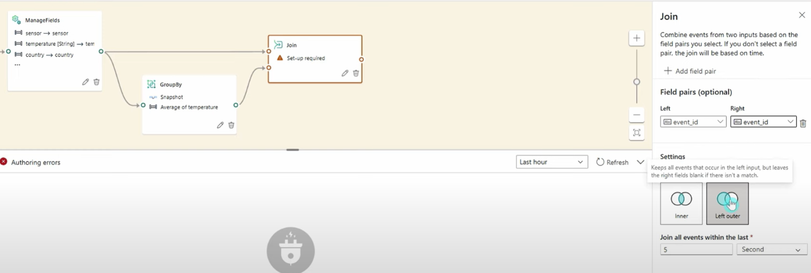
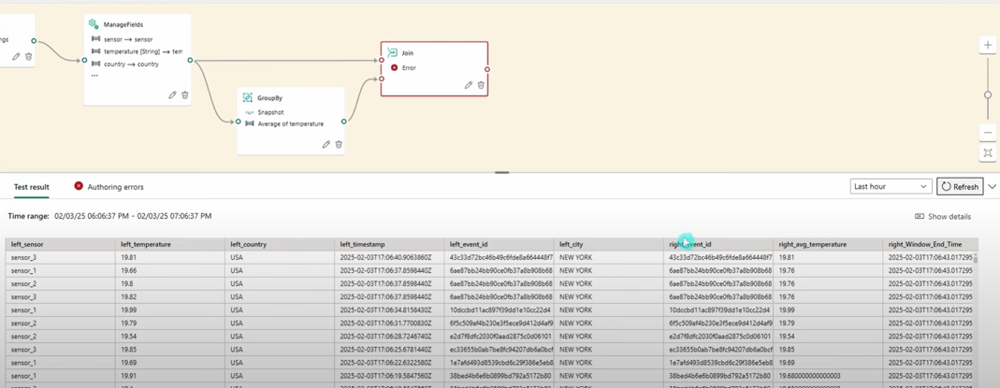

# Eventstream
Event Stream using Fabric

ETL Process for a real-time data using Eventstream
1. Configure Python script to stream data using Event Hub protocol
 

2. Run the script to start streaming

3. Some rows have more than one reading coming from different censors

4. Add Expand transformation to make sure reading from each censor falls on a single row

No more arrays in temperature readings column

5. Add manage fields to select and transform columns

Data after transformation

6. Calculate average temperature by event id using group by

Average temperature by event id

7. Join average temp with original table using Join transformation

Joined tables

8. Select and Rename columns using manage transformation

9. Configure Destination for transformed data and Publish Eventstream so it starts to ingest data

10. Live Eventstream

11. Data in Eventhouse
